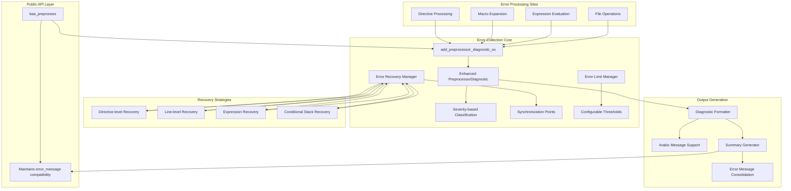
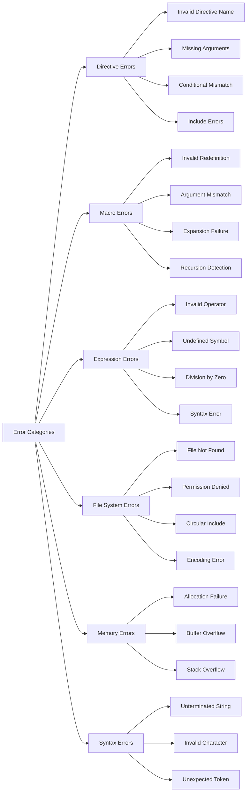
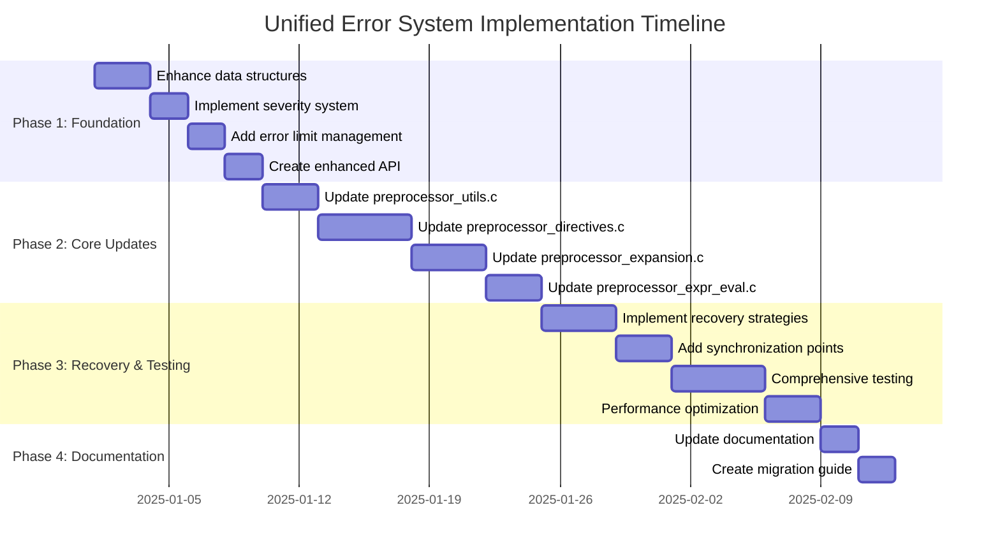

# Unified Error Collection System Architecture for Baa Preprocessor

**Version:** 1.0  
**Date:** December 13, 2024  
**Author:** System Architecture Team  
**Status:** Approved for Implementation

## Table of Contents

1. [Overview](#overview)
2. [Current State Analysis](#current-state-analysis)
3. [System Architecture](#system-architecture)
4. [Data Structures](#data-structures)
5. [API Design](#api-design)
6. [Error Categories and Recovery](#error-categories-and-recovery)
7. [Integration Strategy](#integration-strategy)
8. [Implementation Plan](#implementation-plan)
9. [Testing Strategy](#testing-strategy)
10. [Performance Considerations](#performance-considerations)
11. [Backward Compatibility](#backward-compatibility)

## Overview

This document specifies the architecture for a comprehensive unified error collection system for the Baa preprocessor (v0.1.27.0+). The system enhances the existing error handling foundation to provide robust error recovery, comprehensive diagnostic collection, and maintainable error reporting while preserving backward compatibility.

### Goals

- **Comprehensive Error Collection**: Collect all errors/warnings during preprocessing
- **Intelligent Recovery**: Continue processing after recoverable errors  
- **Maintainable Architecture**: Clear interfaces and consistent usage patterns
- **Performance**: Minimal overhead during error-free processing
- **Arabic Language Support**: Maintain existing Arabic error message support
- **Backward Compatibility**: Preserve existing public API

### Key Requirements

- Add severity levels (fatal, error, warning, note/info)
- Implement configurable error limits (default: 100 errors)
- Maintain current public API while enhancing error_message output
- Systematically update all error reporting sites (176+ locations)
- Support smart error recovery with synchronization points

## Current State Analysis

### Existing Infrastructure

The preprocessor currently has a foundation for error collection:

- **Data Structure**: [`PreprocessorDiagnostic`](src/preprocessor/preprocessor_internal.h:40) structure
- **Collection Function**: [`add_preprocessor_diagnostic`](src/preprocessor/preprocessor_utils.c:784)
- **Storage**: Dynamic array in [`BaaPreprocessor`](src/preprocessor/preprocessor_internal.h:49) structure
- **Location Tracking**: [`PpSourceLocation`](src/preprocessor/preprocessor_internal.h:32) with file, line, column

### Current Issues

- **Mixed Error Reporting**: Many sites use direct `error_message` assignment instead of diagnostic collection
- **Binary Classification**: Only distinguishes errors vs warnings (boolean flag)
- **Immediate Halting**: Most errors cause immediate processing termination
- **No Error Limits**: No protection against error flooding
- **Inconsistent Recovery**: No systematic error recovery strategy

### Error Reporting Site Distribution

| Module | Error Sites | Status |
|--------|-------------|---------|
| [`preprocessor_directives.c`](src/preprocessor/preprocessor_directives.c) | ~176 | Mixed reporting |
| [`preprocessor_expansion.c`](src/preprocessor/preprocessor_expansion.c) | ~30 | Mixed reporting |
| [`preprocessor_expr_eval.c`](src/preprocessor/preprocessor_expr_eval.c) | ~15 | Mixed reporting |
| [`preprocessor_line_processing.c`](src/preprocessor/preprocessor_line_processing.c) | ~25 | Mixed reporting |
| [`preprocessor_core.c`](src/preprocessor/preprocessor_core.c) | ~20 | Mixed reporting |
| **Total** | **~266** | **Needs systematization** |

## System Architecture

### Architecture Overview



### Component Responsibilities

| Component | Responsibility |
|-----------|----------------|
| **Error Collection Core** | Centralized diagnostic storage and classification |
| **Recovery Manager** | Determines appropriate recovery strategies |
| **Limit Manager** | Enforces configurable error thresholds |
| **Synchronization Points** | Safe stopping points for error recovery |
| **Diagnostic Formatter** | Generates user-friendly error messages |
| **Summary Generator** | Creates backward-compatible error summaries |

## Data Structures

### Enhanced Severity Classification

```c
typedef enum {
    PP_DIAG_FATAL,    // System errors - halt immediately (memory, I/O)
    PP_DIAG_ERROR,    // Syntax/semantic errors - continue with recovery
    PP_DIAG_WARNING,  // Warnings - continue processing normally
    PP_DIAG_NOTE      // Informational - continue processing normally
} PpDiagnosticSeverity;
```

### Enhanced Diagnostic Structure

```c
typedef struct {
    wchar_t *message;                    // Formatted diagnostic message
    PpSourceLocation location;           // Original source location
    PpDiagnosticSeverity severity;       // Diagnostic severity level
    uint32_t error_code;                 // Unique error identifier (for i18n)
    const char *category;                // Error category ("directive", "macro", etc.)
    wchar_t *suggestion;                 // Optional fix suggestion (may be NULL)
    struct PreprocessorDiagnostic *next; // For chaining related diagnostics
} PreprocessorDiagnostic;
```

### Error Limit Configuration

```c
typedef struct {
    size_t max_errors;        // Maximum errors before stopping (default: 100)
    size_t max_warnings;      // Maximum warnings before stopping (default: 1000)
    size_t max_notes;         // Maximum notes (default: SIZE_MAX - unlimited)
    bool stop_on_fatal;       // Halt on fatal errors (default: true)
    size_t cascading_limit;   // Max consecutive errors in same context (default: 10)
} PpErrorLimits;
```

### Recovery State Tracking

```c
typedef struct {
    size_t consecutive_errors;     // Track cascading failures
    size_t errors_this_line;      // Prevent infinite loops on single line
    size_t directive_errors;      // Track directive-specific issues
    size_t expression_errors;     // Track expression evaluation failures
    bool in_recovery_mode;        // Flag indicating recovery state
    const char *recovery_context; // Current recovery context
} PpRecoveryState;
```

### Enhanced Preprocessor State

```c
struct BaaPreprocessor {
    // ... existing fields ...
    
    // Enhanced error management
    PreprocessorDiagnostic *diagnostics;
    size_t diagnostic_count;
    size_t diagnostic_capacity;
    
    // Error counting by severity
    size_t fatal_count;
    size_t error_count;
    size_t warning_count;
    size_t note_count;
    
    // Configuration and state
    PpErrorLimits error_limits;
    PpRecoveryState recovery_state;
    bool had_fatal_error;         // Replaces had_error_this_pass
};
```

## API Design

### Enhanced Diagnostic Collection

```c
/**
 * Enhanced diagnostic reporting with full severity and categorization support
 */
void add_preprocessor_diagnostic_ex(
    BaaPreprocessor *pp_state,
    const PpSourceLocation *loc,
    PpDiagnosticSeverity severity,
    uint32_t error_code,
    const char *category,
    const wchar_t *suggestion,
    const wchar_t *format,
    ...
);

/**
 * Convenience macros for common diagnostic types
 */
#define PP_REPORT_FATAL(pp, loc, code, cat, fmt, ...) \
    add_preprocessor_diagnostic_ex(pp, loc, PP_DIAG_FATAL, code, cat, NULL, fmt, ##__VA_ARGS__)

#define PP_REPORT_ERROR(pp, loc, code, cat, fmt, ...) \
    add_preprocessor_diagnostic_ex(pp, loc, PP_DIAG_ERROR, code, cat, NULL, fmt, ##__VA_ARGS__)

#define PP_REPORT_WARNING(pp, loc, code, cat, fmt, ...) \
    add_preprocessor_diagnostic_ex(pp, loc, PP_DIAG_WARNING, code, cat, NULL, fmt, ##__VA_ARGS__)

#define PP_REPORT_NOTE(pp, loc, code, cat, fmt, ...) \
    add_preprocessor_diagnostic_ex(pp, loc, PP_DIAG_NOTE, code, cat, NULL, fmt, ##__VA_ARGS__)
```

### Error Recovery Management

```c
typedef enum {
    PP_RECOVERY_CONTINUE,      // Continue processing normally
    PP_RECOVERY_SKIP_LINE,     // Skip to next line
    PP_RECOVERY_SKIP_DIRECTIVE,// Skip current directive
    PP_RECOVERY_SYNC_CONDITIONAL, // Synchronize conditional stack
    PP_RECOVERY_HALT           // Stop processing
} PpRecoveryAction;

/**
 * Determine appropriate recovery action based on error context
 */
PpRecoveryAction determine_recovery_action(
    BaaPreprocessor *pp_state,
    PpDiagnosticSeverity severity,
    const char *category,
    const PpSourceLocation *location
);

/**
 * Execute recovery action
 */
bool execute_recovery_action(
    BaaPreprocessor *pp_state,
    PpRecoveryAction action,
    const wchar_t **current_position
);
```

### Error Limit Management

```c
/**
 * Check if processing should continue based on error limits
 */
bool should_continue_processing(const BaaPreprocessor *pp_state);

/**
 * Increment error count and check limits
 */
bool increment_error_count(BaaPreprocessor *pp_state, PpDiagnosticSeverity severity);

/**
 * Check if specific error limit reached
 */
bool has_reached_error_limit(const BaaPreprocessor *pp_state, PpDiagnosticSeverity severity);

/**
 * Reset recovery state for new context
 */
void reset_recovery_state(BaaPreprocessor *pp_state, const char *new_context);
```

### Synchronization Functions

```c
/**
 * Directive-level synchronization - skip to next preprocessor directive
 */
bool sync_to_next_directive(BaaPreprocessor *pp_state, const wchar_t **line_ptr);

/**
 * Line-level synchronization - skip to next line
 */
bool sync_to_next_line(BaaPreprocessor *pp_state, const wchar_t **line_ptr);

/**
 * Expression recovery - skip to next safe point in expression
 */
bool sync_expression_parsing(
    BaaPreprocessor *pp_state, 
    const wchar_t **expr_ptr,
    wchar_t terminator
);

/**
 * Conditional stack recovery - attempt to repair conditional nesting
 */
bool recover_conditional_stack(BaaPreprocessor *pp_state);
```

## Error Categories and Recovery

### Error Category Classification



### Recovery Strategy Matrix

| Category | Error Type | Severity | Recovery Action | Synchronization Point |
|----------|------------|----------|-----------------|----------------------|
| **Directive** | Unknown directive | ERROR | Skip directive | Next line |
| **Directive** | Missing `#نهاية_إذا` | ERROR | Auto-insert at EOF | End of file |
| **Directive** | Invalid include path | ERROR | Skip include | Next line |
| **Macro** | Redefinition warning | WARNING | Use new definition | Continue |
| **Macro** | Argument count mismatch | ERROR | Skip expansion | Continue parsing |
| **Macro** | Invalid parameter name | ERROR | Skip macro definition | Next line |
| **Expression** | Undefined identifier | WARNING | Treat as 0 | Continue evaluation |
| **Expression** | Division by zero | ERROR | Return 0 | Continue evaluation |
| **Expression** | Invalid operator | ERROR | Skip operator | Next operand |
| **File** | File not found | ERROR | Skip include | Next line |
| **File** | Circular include | ERROR | Skip include | Next line |
| **File** | Encoding error | ERROR | Skip file | Next line |
| **Memory** | Allocation failure | FATAL | Halt immediately | N/A |
| **Memory** | Stack overflow | FATAL | Halt immediately | N/A |
| **Syntax** | Unterminated string | ERROR | Auto-terminate | End of line |
| **Syntax** | Invalid character | WARNING | Skip character | Next character |

### Error Code Ranges

```c
// Error code ranges for categorization
#define PP_ERROR_DIRECTIVE_BASE    1000
#define PP_ERROR_MACRO_BASE        2000  
#define PP_ERROR_EXPRESSION_BASE   3000
#define PP_ERROR_FILE_BASE         4000
#define PP_ERROR_MEMORY_BASE       5000
#define PP_ERROR_SYNTAX_BASE       6000

// Example specific error codes
#define PP_ERROR_UNKNOWN_DIRECTIVE     (PP_ERROR_DIRECTIVE_BASE + 1)
#define PP_ERROR_MISSING_ENDIF         (PP_ERROR_DIRECTIVE_BASE + 2)
#define PP_ERROR_INVALID_INCLUDE       (PP_ERROR_DIRECTIVE_BASE + 3)
#define PP_ERROR_MACRO_REDEFINITION    (PP_ERROR_MACRO_BASE + 1)
#define PP_ERROR_MACRO_ARG_MISMATCH    (PP_ERROR_MACRO_BASE + 2)
#define PP_ERROR_DIVISION_BY_ZERO      (PP_ERROR_EXPRESSION_BASE + 1)
#define PP_ERROR_UNDEFINED_IDENTIFIER  (PP_ERROR_EXPRESSION_BASE + 2)
#define PP_ERROR_FILE_NOT_FOUND        (PP_ERROR_FILE_BASE + 1)
#define PP_ERROR_CIRCULAR_INCLUDE      (PP_ERROR_FILE_BASE + 2)
#define PP_ERROR_OUT_OF_MEMORY         (PP_ERROR_MEMORY_BASE + 1)
```

## Integration Strategy

### Implementation Phases



### File Update Priority

1. **Phase 1: Foundation** (9 days)
   - [`src/preprocessor/preprocessor_internal.h`](src/preprocessor/preprocessor_internal.h) - Enhanced data structures
   - [`src/preprocessor/preprocessor_utils.c`](src/preprocessor/preprocessor_utils.c) - Core diagnostic functions
   
2. **Phase 2: Core Modules** (15 days)
   - [`src/preprocessor/preprocessor_directives.c`](src/preprocessor/preprocessor_directives.c) - Highest error count (~176 sites)
   - [`src/preprocessor/preprocessor_expansion.c`](src/preprocessor/preprocessor_expansion.c) - Complex macro handling (~30 sites)
   - [`src/preprocessor/preprocessor_expr_eval.c`](src/preprocessor/preprocessor_expr_eval.c) - Expression evaluation (~15 sites)
   - [`src/preprocessor/preprocessor_line_processing.c`](src/preprocessor/preprocessor_line_processing.c) - Line processing (~25 sites)

3. **Phase 3: Support Modules** (15 days)
   - [`src/preprocessor/preprocessor_core.c`](src/preprocessor/preprocessor_core.c) - File processing (~20 sites)
   - [`src/preprocessor/preprocessor_conditionals.c`](src/preprocessor/preprocessor_conditionals.c) - Conditional handling
   - [`src/preprocessor/preprocessor_macros.c`](src/preprocessor/preprocessor_macros.c) - Macro management

### Migration Strategy for Each Module

```c
// Example migration pattern for preprocessor_directives.c

// BEFORE (immediate error reporting):
if (invalid_condition) {
    *error_message = format_preprocessor_error_at_location(&loc, L"خطأ في التوجيه");
    return false;
}

// AFTER (diagnostic collection with recovery):
if (invalid_condition) {
    PP_REPORT_ERROR(pp_state, &loc, PP_ERROR_INVALID_DIRECTIVE, "directive", 
                   L"خطأ في التوجيه");
    
    PpRecoveryAction action = determine_recovery_action(pp_state, PP_DIAG_ERROR, 
                                                       "directive", &loc);
    if (action == PP_RECOVERY_HALT) {
        return false;
    }
    
    return execute_recovery_action(pp_state, action, &current_position);
}
```

## Implementation Plan

### Detailed Implementation Steps

#### Step 1: Enhanced Data Structures (3 days)

**File**: [`src/preprocessor/preprocessor_internal.h`](src/preprocessor/preprocessor_internal.h)

```c
// Add new enums and structures
typedef enum PpDiagnosticSeverity { ... };
typedef struct PpErrorLimits { ... };
typedef struct PpRecoveryState { ... };

// Enhance PreprocessorDiagnostic structure
typedef struct PreprocessorDiagnostic {
    wchar_t *message;
    PpSourceLocation location;
    PpDiagnosticSeverity severity;  // NEW
    uint32_t error_code;           // NEW
    const char *category;          // NEW
    wchar_t *suggestion;          // NEW
} PreprocessorDiagnostic;

// Enhance BaaPreprocessor structure
struct BaaPreprocessor {
    // ... existing fields ...
    
    // Enhanced error management
    size_t fatal_count;           // NEW
    size_t error_count;          // NEW  
    size_t warning_count;        // NEW
    size_t note_count;           // NEW
    PpErrorLimits error_limits;   // NEW
    PpRecoveryState recovery_state; // NEW
    bool had_fatal_error;        // REPLACE had_error_this_pass
};
```

#### Step 2: Core API Implementation (5 days)

**File**: [`src/preprocessor/preprocessor_utils.c`](src/preprocessor/preprocessor_utils.c)

```c
// Enhanced diagnostic collection function
void add_preprocessor_diagnostic_ex(
    BaaPreprocessor *pp_state,
    const PpSourceLocation *loc,
    PpDiagnosticSeverity severity,
    uint32_t error_code,
    const char *category,
    const wchar_t *suggestion,
    const wchar_t *format,
    ...
) {
    // Input validation
    if (!pp_state || !loc || !format) return;
    
    // Check error limits before adding
    if (!should_continue_processing(pp_state)) {
        return;
    }
    
    // Increment appropriate counter
    if (!increment_error_count(pp_state, severity)) {
        return; // Hit error limit
    }
    
    // Create diagnostic entry
    // ... (detailed implementation)
    
    // Set fatal flag if needed
    if (severity == PP_DIAG_FATAL) {
        pp_state->had_fatal_error = true;
    }
}

// Error limit management
bool should_continue_processing(const BaaPreprocessor *pp_state) {
    return !pp_state->had_fatal_error &&
           pp_state->error_count < pp_state->error_limits.max_errors &&
           pp_state->warning_count < pp_state->error_limits.max_warnings;
}

bool increment_error_count(BaaPreprocessor *pp_state, PpDiagnosticSeverity severity) {
    switch (severity) {
        case PP_DIAG_FATAL:
            pp_state->fatal_count++;
            return !pp_state->error_limits.stop_on_fatal;
        case PP_DIAG_ERROR:
            pp_state->error_count++;
            return pp_state->error_count < pp_state->error_limits.max_errors;
        case PP_DIAG_WARNING:
            pp_state->warning_count++;
            return pp_state->warning_count < pp_state->error_limits.max_warnings;
        case PP_DIAG_NOTE:
            pp_state->note_count++;
            return true; // Notes don't stop processing
    }
    return true;
}

// Recovery strategy implementation
PpRecoveryAction determine_recovery_action(
    BaaPreprocessor *pp_state,
    PpDiagnosticSeverity severity,
    const char *category,
    const PpSourceLocation *location
) {
    // Check for fatal errors
    if (severity == PP_DIAG_FATAL) {
        return PP_RECOVERY_HALT;
    }
    
    // Check cascading error limits
    if (pp_state->recovery_state.consecutive_errors > pp_state->error_limits.cascading_limit) {
        return PP_RECOVERY_HALT;
    }
    
    // Category-specific recovery logic
    if (strcmp(category, "directive") == 0) {
        return PP_RECOVERY_SKIP_DIRECTIVE;
    } else if (strcmp(category, "expression") == 0) {
        return PP_RECOVERY_CONTINUE; // Can usually continue expression evaluation
    } else if (strcmp(category, "macro") == 0) {
        return PP_RECOVERY_CONTINUE; // Skip expansion, continue parsing
    } else if (strcmp(category, "file") == 0) {
        return PP_RECOVERY_SKIP_LINE; // Skip include, continue
    }
    
    return PP_RECOVERY_CONTINUE;
}
```

#### Step 3: Synchronization Functions (3 days)

```c
// Directive-level synchronization
bool sync_to_next_directive(BaaPreprocessor *pp_state, const wchar_t **line_ptr) {
    if (!line_ptr || !*line_ptr) return false;
    
    // Skip to end of current line
    while (**line_ptr && **line_ptr != L'\n') {
        (*line_ptr)++;
    }
    
    // Skip the newline if present
    if (**line_ptr == L'\n') {
        (*line_ptr)++;
        pp_state->current_line_number++;
        pp_state->current_column_number = 1;
    }
    
    // Reset recovery state for new line
    pp_state->recovery_state.errors_this_line = 0;
    
    return true;
}

// Expression recovery
bool sync_expression_parsing(
    BaaPreprocessor *pp_state,
    const wchar_t **expr_ptr,
    wchar_t terminator
) {
    if (!expr_ptr || !*expr_ptr) return false;
    
    // Skip to next safe parsing point
    int paren_depth = 0;
    while (**expr_ptr && **expr_ptr != terminator) {
        if (**expr_ptr == L'(') {
            paren_depth++;
        } else if (**expr_ptr == L')') {
            paren_depth--;
            if (paren_depth < 0) break;
        }
        (*expr_ptr)++;
    }
    
    return **expr_ptr != L'\0';
}

// Conditional stack recovery
bool recover_conditional_stack(BaaPreprocessor *pp_state) {
    // Attempt to synchronize conditional stack
    // Look for matching #endif directives
    // Report missing #endif errors
    // Auto-insert missing conditionals where possible
    
    return true; // Implementation depends on conditional stack structure
}
```

#### Step 4: Module Updates (15 days)

**Priority Order:**

1. **[`preprocessor_directives.c`](src/preprocessor/preprocessor_directives.c)** (5 days) - 176 error sites
2. **[`preprocessor_expansion.c`](src/preprocessor/preprocessor_expansion.c)** (4 days) - 30 error sites  
3. **[`preprocessor_expr_eval.c`](src/preprocessor/preprocessor_expr_eval.c)** (3 days) - 15 error sites
4. **[`preprocessor_line_processing.c`](src/preprocessor/preprocessor_line_processing.c)** (3 days) - 25 error sites

**Example Update Pattern:**

```c
// BEFORE: Direct error_message assignment
if (some_error_condition) {
    *error_message = format_preprocessor_error_at_location(&loc, 
        L"تنسيق #تعريف غير صالح: اسم الماكرو مفقود.");
    success = false;
    goto cleanup;
}

// AFTER: Diagnostic collection with recovery
if (some_error_condition) {
    PP_REPORT_ERROR(pp_state, &loc, PP_ERROR_MISSING_MACRO_NAME, "directive",
        L"تنسيق #تعريف غير صالح: اسم الماكرو مفقود.");
    
    PpRecoveryAction action = determine_recovery_action(pp_state, PP_DIAG_ERROR, 
                                                       "directive", &loc);
    if (action == PP_RECOVERY_HALT) {
        success = false;
        goto cleanup;
    }
    
    if (action == PP_RECOVERY_SKIP_DIRECTIVE) {
        // Skip to next line and continue
        sync_to_next_directive(pp_state, &directive_ptr);
        continue; // or appropriate control flow
    }
    
    // Continue processing with recovered state
}
```

## Testing Strategy

### Test Categories

```mermaid
graph TD
    A[Testing Strategy] --> B[Unit Tests]
    A --> C[Integration Tests]
    A --> D[Recovery Tests]
    A --> E[Performance Tests]
    A --> F[Regression Tests]
    
    B --> B1[Error Collection Functions]
    B --> B2[Severity Classification]
    B --> B3[Limit Management]
    B --> B4[Recovery Decision Logic]
    
    C --> C1[End-to-end Processing]
    C --> C2[Multi-file Scenarios]
    C --> C3[Complex Macro Expansion]
    C --> C4[Error Message Formatting]
    
    D --> D1[Directive Error Recovery]
    D --> D2[Macro Error Recovery]
    D --> D3[Expression Error Recovery]
    D --> D4[Cascading Error Handling]
    
    E --> E1[Memory Usage with Many Errors]
    E --> E2[Processing Speed Impact]
    E --> E3[Large File Error Handling]
    E --> E4[Error Limit Performance]
    
    F --> F1[Backward Compatibility]
    F --> F2[Existing Error Messages]
    F --> F3[API Compatibility]
    F --> F4[Error Format Consistency]
```



### Specific Test Cases

#### Unit Tests

**File**: `tests/unit/preprocessor/test_error_system.c`

```c
// Test error severity classification
void test_error_severity_classification() {
    BaaPreprocessor pp_state = {0};
    init_preprocessor_error_system(&pp_state);
    
    PpSourceLocation loc = {"test.baa", 1, 1};
    
    // Test fatal error
    PP_REPORT_FATAL(&pp_state, &loc, PP_ERROR_OUT_OF_MEMORY, "memory", 
                    L"فشل في تخصيص الذاكرة");
    assert(pp_state.fatal_count == 1);
    assert(pp_state.had_fatal_error == true);
    
    // Test error limit enforcement
    for (int i = 0; i < 150; i++) {
        PP_REPORT_ERROR(&pp_state, &loc, PP_ERROR_UNKNOWN_DIRECTIVE, "directive",
                       L"توجيه غير معروف");
    }
    assert(pp_state.error_count == 100); // Should stop at limit
    
    cleanup_preprocessor_error_system(&pp_state);
}

// Test recovery action determination
void test_recovery_action_determination() {
    BaaPreprocessor pp_state = {0};
    init_preprocessor_error_system(&pp_state);
    
    PpSourceLocation loc = {"test.baa", 1, 1};
    
    // Test directive error recovery
    PpRecoveryAction action = determine_recovery_action(&pp_state, PP_DIAG_ERROR, 
                                                       "directive", &loc);
    assert(action == PP_RECOVERY_SKIP_DIRECTIVE);
    
    // Test fatal error recovery
    action = determine_recovery_action(&pp_state, PP_DIAG_FATAL, "memory", &loc);
    assert(action == PP_RECOVERY_HALT);
    
    cleanup_preprocessor_error_system(&pp_state);
}
```

#### Integration Tests

**File**: `tests/integration/test_error_recovery.c`

```c
// Test comprehensive error recovery scenarios
void test_directive_error_recovery() {
    const wchar_t *test_input = L"""
        #تعريف VALID_MACRO 42
        #unknown_directive invalid syntax
        #تعريف ANOTHER_VALID 123
        #إذا VALID_MACRO > 40
            #تضمين "nonexistent.h"
            int x = ANOTHER_VALID;
        #نهاية_إذا
    """;
    
    BaaPpSource source = {
        .type = BAA_PP_SOURCE_STRING,
        .source_name = "test_recovery.baa",
        .data.source_string = test_input
    };
    
    wchar_t *error_message = NULL;
    wchar_t *result = baa_preprocess(&source, NULL, &error_message);
    
    // Should successfully process despite errors
    assert(result != NULL);
    
    // Should contain processed valid content
    assert(wcsstr(result, L"int x = 123;") != NULL);
    
    // Should have collected multiple errors
    assert(error_message != NULL);
    assert(wcsstr(error_message, L"unknown_directive") != NULL);
    assert(wcsstr(error_message, L"nonexistent.h") != NULL);
    
    free(result);
    free(error_message);
}
```

#### Performance Tests

```c
// Test performance with many errors
void test_error_collection_performance() {
    const size_t num_errors = 10000;
    clock_t start = clock();
    
    BaaPreprocessor pp_state = {0};
    init_preprocessor_error_system(&pp_state);
    
    PpSourceLocation loc = {"test.baa", 1, 1};
    
    for (size_t i = 0; i < num_errors; i++) {
        PP_REPORT_WARNING(&pp_state, &loc, PP_ERROR_UNDEFINED_IDENTIFIER, "expression",
                         L"معرف غير معرف: test_%zu", i);
    }
    
    clock_t end = clock();
    double duration = ((double)(end - start)) / CLOCKS_PER_SEC;
    
    // Should handle 10k errors in reasonable time (< 1 second)
    assert(duration < 1.0);
    assert(pp_state.warning_count <= pp_state.error_limits.max_warnings);
    
    cleanup_preprocessor_error_system(&pp_state);
}
```

### Test Data Files

**File**: `tests/resources/error_test_cases/recovery_scenarios.baa`

```baa
# Test file for error recovery scenarios

# Valid content before errors
#تعريف PI 3.14159

# Directive errors
#invalid_directive_name some content
#تعريف # Missing macro name
#إذا PI > 3
    # Missing endif (should be auto-detected)

# Macro errors  
#تعريف FUNC(a, b, c) a + b + c
FUNC(1, 2) # Wrong argument count

# Expression errors
#إذا UNDEFINED_MACRO / 0 > 1  # Division by zero with undefined
    int valid_code = PI * 2;
#نهاية_إذا

# File errors
#تضمين "does_not_exist.h"
#تضمين <missing_system_header>

# More valid content after errors
#تعريف FINAL_MACRO 42
int result = FINAL_MACRO;
```

## Performance Considerations

### Memory Management

#### Diagnostic Storage Optimization

```c
// Efficient diagnostic storage with pooling
typedef struct DiagnosticPool {
    PreprocessorDiagnostic *diagnostics;
    size_t capacity;
    size_t used;
    size_t next_free;
} DiagnosticPool;

// Pre-allocate diagnostic pool to reduce allocations
bool init_diagnostic_pool(DiagnosticPool *pool, size_t initial_capacity) {
    pool->diagnostics = calloc(initial_capacity, sizeof(PreprocessorDiagnostic));
    if (!pool->diagnostics) return false;
    
    pool->capacity = initial_capacity;
    pool->used = 0;
    pool->next_free = 0;
    
    return true;
}

// Fast diagnostic allocation from pool
PreprocessorDiagnostic* allocate_diagnostic(DiagnosticPool *pool) {
    if (pool->next_free >= pool->capacity) {
        // Expand pool if needed
        size_t new_capacity = pool->capacity * 2;
        PreprocessorDiagnostic *new_diagnostics = realloc(pool->diagnostics, 
                                                          new_capacity * sizeof(PreprocessorDiagnostic));
        if (!new_diagnostics) return NULL;
        
        pool->diagnostics = new_diagnostics;
        pool->capacity = new_capacity;
    }
    
    return &pool->diagnostics[pool->next_free++];
}
```

#### Message String Interning

```c
// Intern common error message patterns to reduce memory usage
typedef struct MessageIntern {
    const wchar_t *pattern;
    size_t ref_count;
} MessageIntern;

static MessageIntern common_messages[] = {
    {L"فشل في تخصيص الذاكرة", 0},
    {L"توجيه غير معروف", 0},
    {L"ملف غير موجود", 0},
    // ... more common patterns
};

const wchar_t* intern_message_pattern(const wchar_t *message) {
    for (size_t i = 0; i < ARRAY_SIZE(common_messages); i++) {
        if (wcscmp(message, common_messages[i].pattern) == 0) {
            common_messages[i].ref_count++;
            return common_messages[i].pattern;
        }
    }
    return wcsdup(message); // Fall back to duplication
}
```

### Processing Speed Optimization

#### Error-Free Fast Path

```c
// Optimize for the common case of no errors
static inline bool has_any_errors(const BaaPreprocessor *pp_state) {
    return pp_state->diagnostic_count > 0;
}

// Fast path for error-free processing
bool process_directive_fast_path(BaaPreprocessor *pp_state, /* ... */) {
    // Optimized processing without error checking overhead
    // Only switch to full error handling when first error occurs
    
    if (LIKELY(!has_any_errors(pp_state))) {
        // Fast path implementation
        return process_directive_no_error_checks(/* ... */);
    } else {
        // Full error handling path
        return process_directive_with_error_handling(/* ... */);
    }
}
```

#### Lazy Error Message Formatting

```c
// Defer expensive message formatting until actually needed
typedef struct LazyDiagnostic {
    PpSourceLocation location;
    PpDiagnosticSeverity severity;
    uint32_t error_code;
    const char *category;
    const wchar_t *format;
    va_list args; // Stored for later formatting
    bool formatted;
    wchar_t *cached_message;
} LazyDiagnostic;

// Only format when error message is actually requested
const wchar_t* get_diagnostic_message(LazyDiagnostic *diag) {
    if (!diag->formatted) {
        diag->cached_message = format_diagnostic_message(diag->format, diag->args);
        diag->formatted = true;
    }
    return diag->cached_message;
}
```

### Benchmarking Targets

| Scenario | Target Performance | Current Baseline |
|----------|-------------------|------------------|
| **Error-free processing** | < 5% overhead | TBD |
| **10 errors** | < 10% overhead | TBD |
| **100 errors** | < 25% overhead | TBD |
| **1000 errors** | < 50% overhead | TBD |
| **Memory usage (100 errors)** | < 100KB additional | TBD |
| **Error formatting** | < 1ms per error | TBD |

## Backward Compatibility

### Public API Preservation

The existing [`baa_preprocess`](include/baa/preprocessor/preprocessor.h:59) function signature remains unchanged:

```c
wchar_t* baa_preprocess(const BaaPpSource* source, const char** include_paths, wchar_t** error_message);
```

### Error Message Consolidation

```c
/**
 * Generate backward-compatible error summary from collected diagnostics
 */
wchar_t* generate_error_summary(const BaaPreprocessor *pp_state) {
    if (pp_state->diagnostic_count == 0) {
        return NULL; // No errors
    }
    
    DynamicWcharBuffer summary = {0};
    if (!init_dynamic_buffer(&summary, 1024)) {
        return baa_strdup(L"فشل في إنشاء ملخص الأخطاء");
    }
    
    // Add summary header
    append_to_dynamic_buffer(&summary, L"تم العثور على ");
    if (pp_state->fatal_count > 0) {
        append_to_dynamic_buffer(&summary, L"%zu خطأ فادح، ", pp_state->fatal_count);
    }
    if (pp_state->error_count > 0) {
        append_to_dynamic_buffer(&summary, L"%zu خطأ، ", pp_state->error_count);
    }
    if (pp_state->warning_count > 0) {
        append_to_dynamic_buffer(&summary, L"%zu تحذير", pp_state->warning_count);
    }
    append_to_dynamic_buffer(&summary, L":\n\n");
    
    // Add detailed error messages (limit to first 10 for readability)
    size_t errors_shown = 0;
    const size_t max_errors_in_summary = 10;
    
    for (size_t i = 0; i < pp_state->diagnostic_count && errors_shown < max_errors_in_summary; i++) {
        const PreprocessorDiagnostic *diag = &pp_state->diagnostics[i];
        
        // Skip notes in summary for brevity
        if (diag->severity == PP_DIAG_NOTE) continue;
        
        append_to_dynamic_buffer(&summary, diag->message);
        append_to_dynamic_buffer(&summary, L"\n");
        errors_shown++;
    }
    
    // Add truncation notice if more errors exist
    if (pp_state->diagnostic_count > max_errors_in_summary) {
        size_t remaining = pp_state->diagnostic_count - max_errors_in_summary;
        append_to_dynamic_buffer(&summary, L"\n... و %zu خطأ إضافي\n", remaining);
    }
    
    return summary.buffer; // Transfer ownership
}
```

### Legacy Error Format Compatibility

```c
// Maintain compatibility with existing error message patterns
static const wchar_t* legacy_error_prefixes[] = {
    L"خطأ في المعالج المسبق", // Preprocessor error
    L"تحذير في المعالج المسبق", // Preprocessor warning
    NULL
};

bool is_legacy_error_format(const wchar_t *message) {
    for (size_t i = 0; legacy_error_prefixes[i]; i++) {
        if (wcsstr(message, legacy_error_prefixes[i]) == message) {
            return true;
        }
    }
    return false;
}

// Ensure new error messages maintain compatible format
wchar_t* format_compatible_error_message(const PpSourceLocation *loc, 
                                        PpDiagnosticSeverity severity,
                                        const wchar_t *message) {
    const wchar_t *prefix = (severity == PP_DIAG_WARNING) ? 
                           L"تحذير في المعالج المسبق" : 
                           L"خطأ في المعالج المسبق";
    
    return format_preprocessor_error_at_location(loc, L"%ls: %ls", prefix, message);
}
```

### Migration Safety

```c
// Compile-time assertions to ensure structure compatibility
#if defined(__STDC_VERSION__) && __STDC_VERSION__ >= 201112L
_Static_assert(offsetof(struct BaaPreprocessor, diagnostics) >= 
               offsetof(struct BaaPreprocessor, current_column_number),
               "New fields must be added after existing fields");
#endif

// Runtime validation for backward compatibility
bool validate_preprocessor_compatibility(const BaaPreprocessor *pp_state) {
    // Ensure critical fields are still accessible
    return pp_state && 
           pp_state->diagnostics != NULL &&
           pp_state->diagnostic_capacity > 0;
}
```

---

## Conclusion

This unified error collection system architecture provides a comprehensive foundation for robust error handling in the Baa preprocessor. The design maintains backward compatibility while enabling sophisticated error recovery and diagnostic collection capabilities.

### Key Benefits

1. **Comprehensive Error Collection**: All errors are collected and reported at the end
2. **Intelligent Recovery**: Smart synchronization allows processing to continue after most errors
3. **Maintainable Architecture**: Clear interfaces and systematic error handling
4. **Performance Optimized**: Minimal overhead during error-free processing
5. **Arabic Language Support**: Maintains existing Arabic error message capabilities
6. **Backward Compatible**: Existing code continues to work without changes

### Implementation Success Criteria

- [ ] All 266+ error reporting sites updated to use new system
- [ ] Error recovery enables processing of files with multiple issues
- [ ] Performance overhead < 5% for error-free processing
- [ ] Comprehensive test coverage for all error scenarios
- [ ] Full backward compatibility with existing API
- [ ] Arabic error messages properly formatted and displayed

This architecture serves as the foundation for implementing a world-class error handling system that will significantly improve the developer experience when working with the Baa preprocessor.